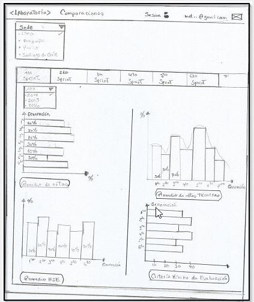

# Reto - Dashboard de Laboratoria
***
## Objetivo
Crear un sketch para el dashboard de Laboratoria, esta herramienta será utilizada por profesores, training managers, directores y gerentes de Laboratoria para ver rápidamente qué está pasando en el salón de clases de Laboratoria.
En el dashboard, los usuarios mencionados pueden ver rápidamente estadísticas y datos en tiempo real como:

* n° de alumnas inscritas
* n° de alumnas que desertaron
* n° y % de alumnas que pasan el criterio mínimo de evaluación
* Promedio de notas por sprint
* Promedio de notas HSE
* Promedio de notas técnicas

Además, dado que Laboratoria tiene muchas generaciones, regularmente 2 generaciones por año (estas generaciones empezaron en el 2014), y que opera en 4 sedes (Arequipa, Ciudad de México, Lima y Santiago de Chile), es posible que los usuarios quieran ver datos de sedes / generaciones anteriores para poder hacer comparaciones.

## Resultado

### Dashboard general
En esta imagen se presenta el dashboard general que incluye lo siguiente:
* En la parte izquierda se encuentra una lista despegable para ubicar las sedes de Laboratoria y dentro de ellas se encuntran los años conjunatamente con las generaciones (1ra, 2da , etc).
* En la parte derecha superiror se presenta un encabezado para iniciar sesion con su correo
* En esa misma parte se presenta el titulo donde esta la sede,año y generación.Seguidamente se encuentra el n° de alumnas y las que desertaron.
* Por último se encuentra los graficos que son:
  - Gráficos de barras verticales presenta el promedio de las notas por sprint.
  - Gráficos de barras horizontales presenta el promedio de las notas técnicas.
  - Tabla presenta el promedio de las notas técnicas.
  - Gráfico circular tiene el criterio mínimo de notas de evaluación.

### Dashboard comparación
En esta imagen se presenta el dashboard para la comparación por generaciones, que incluye lo siguiente:
* Se ingresa en la parte izquierda, donde hay un item que indica comparaciones.
* Esta parte presentara una nueva ventana donde se encuentra un menu despegable por sede.
* Luego un recuadro que esta dividido por sprints.
* En dicho recuadro cada sprint tiene otro menú despegable del año.
* Cada gráfico es comparado por generaciones.

